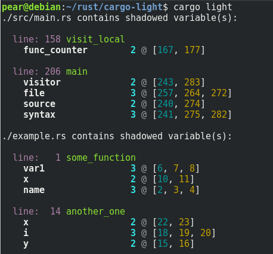

# cargo-light

cargo light is a tool to that finds and counts shadowed variables in valid rust source code (lights up the shadows!). A shadowed variable is a newly bounded local variable with the same identifier as a previous one. This pattern helps with unwrapping and 'mutating' immutable variables, as well as changing types.

Example:

```rust
// An immutable variable.
let res: Result<usize, some::Error> = Ok(10);
// "mutate" and change it's type to make the code easier to follow:
let res: usize = res.unwrap();
// Now res is a different type but has the same name.
// This isn't necessarily bad, but it can sometimes
// lead to confusion in large functions.
println!("{}", res);
```

### Example Usage

When run in the source directory with no flags, `cargo-light` attempts to parse every .rs file in the directory (same as `-d .`):



The output for a given file will list the function with its line number, and then the locations of any shadowed variables within that function, along with the identifier used. The first number is the number of shadows. The blue number at the beginning of the list denotes the original local binding of that variable. Yellow denotes a local binding that uses the same identifier as the original.

use `cargo light -h` to see the full usage options.

## Installing

As this is a cargo subcommand, cargo must be installed on the system. The binary can be built with nightly rust, `rustc 1.29.0-nightly (254f8796b 2018-07-13)`. Other versions of the compiler have not yet been tested, but should work.

First clone the repository:

```
git clone https://github.com/fisherdarling/cargo-light.git
```

Move into the folder and install it (\*):

```
cd cargo-light
RUSTFLAGS="--cfg procmacro2_semver_exempt" cargo install --path .
```

Test that it works:

```
cargo light -h
```

(\*): `RUSTFLAGS="--cfg procmacro2_semver_exempt"` is needed to build proc-macro2 with the cfg required to access line information. Please open an issue if there is a better way to do this!

## TODO:

- Learn how to correctly parse a pattern type that's more than just `let a = 5;`
- Learn how to match an identifier to a type. This would require some sort of iterator that matches over the left pattern with the right pattern(?) at the same time i.e:

  ```rust
  let (a, b): (i32, usize) = (12, 4);
  ```

- Properly parse function arguments.
- Add tests.

## Contributing

As this is my first ever real public project, any feedback at all will be greatly appreciated :smile:. Please open an issue or send a pull request!

## Authors

- Fisher Darling

## License

This project is licensed under the MIT License - see the [LICENSE.md](./LICENSE.md) file for details.

### Acknowledgments

- The code is heavily based off of [cargo-geiger](https://github.com/anderejd/cargo-geiger) and [cargo-osha](https://github.com/icefoxen/cargo-osha). A big thanks to the contributors of those projects!
- Another big thanks to the writers of my dependencies. The api for `colored`, and `syn` were really nice!

